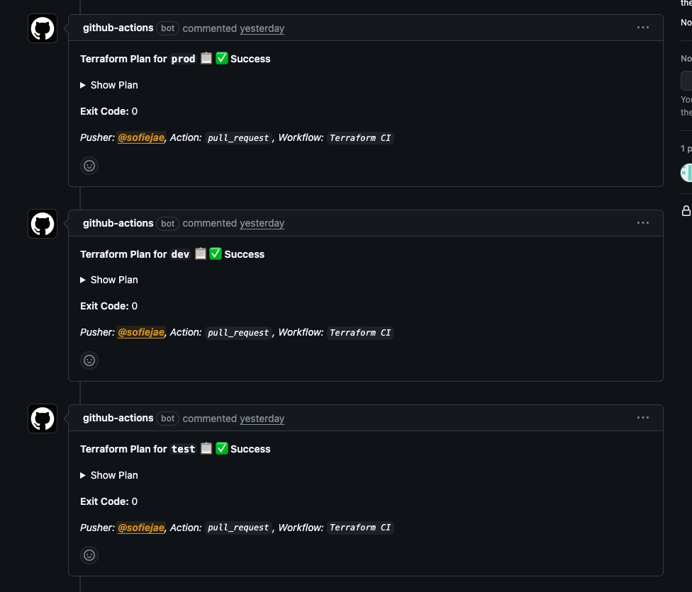
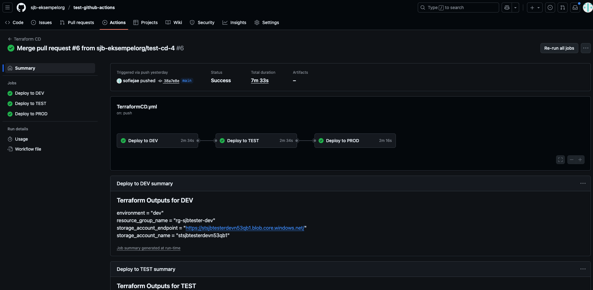

# Hvordan rulle ut nye ressurser?
## 1. Gjør lokale endringer
Lag først en separat git branch. Først sørg for at du står i main.

```git checkout -b <local_branch_name>```

Lag også en remote branch hvor du kan pushe endringer:

```git push --set-upstream <remote_name> <local_branch_name>```

Gjør så alle endringer og commits man ønsker i mappen ```terraform```.

## 2. Publiser endringene
Når du har gjort din din siste commit, push til din remote branch. 

Gå til Github-repoet og lag en pull request. Når den opprettes vil det automatisk kjøres en CI-pipeline. Nå kan man se en plan for hva som endres i hvert miljø. Når testene er kjørt, og alt er godkjent for de tre miljøene, vil du se følgende:


## 3. Deploy endringene
Når du ønsker å deploye endringene trykker du på "Merge Pull-Request"-knappen. Gå til Actions-fanen for å se at CD-pipelinen starter. 

Hvis utrullingen er gjennomført i alle miljøene vil du se følgende:

